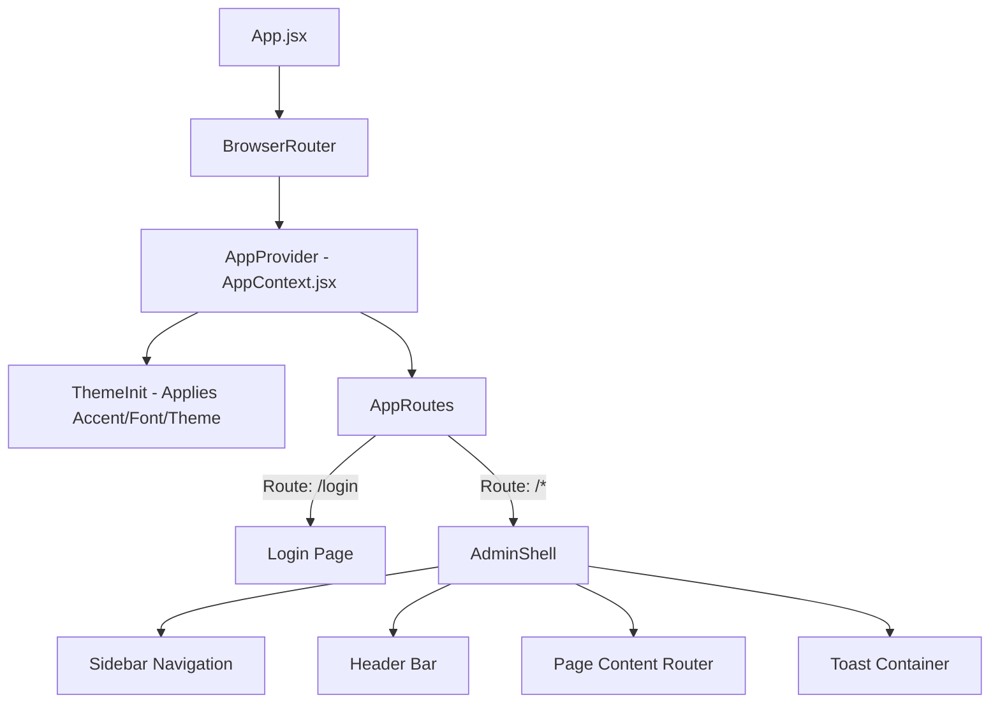
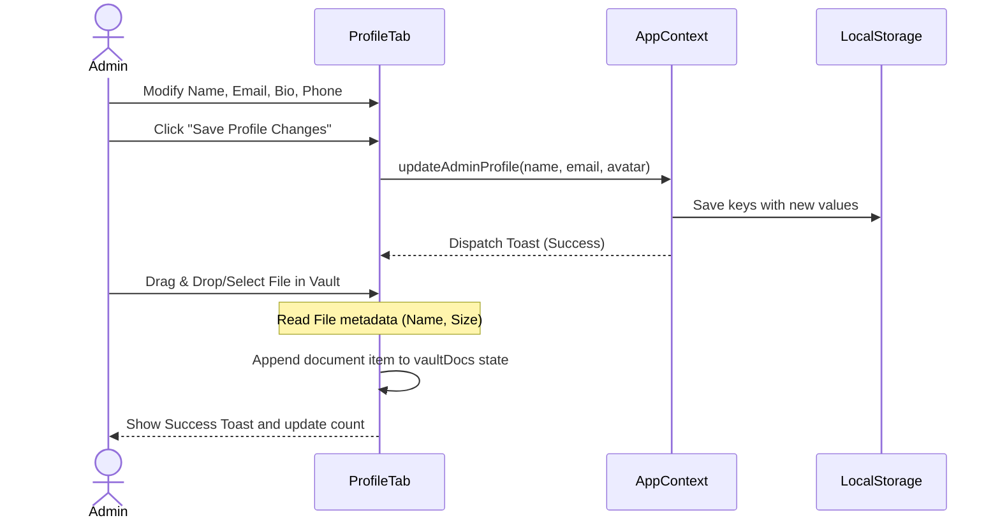
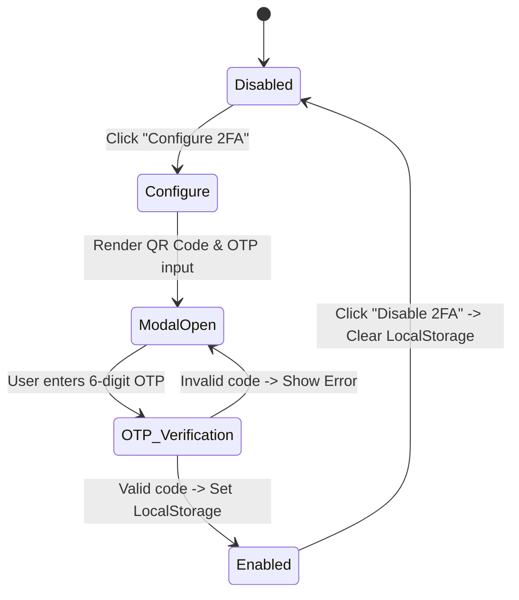
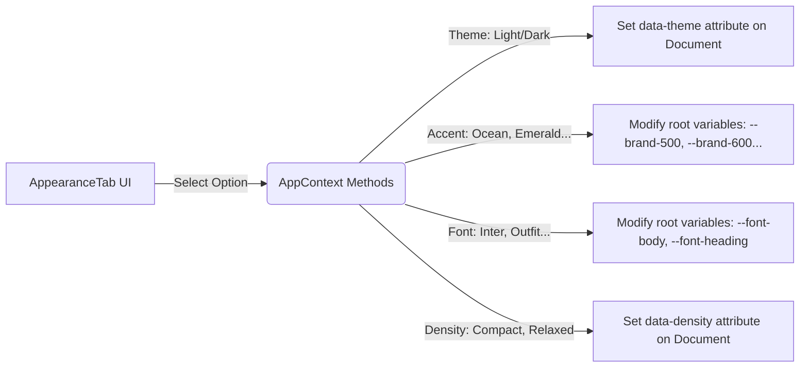
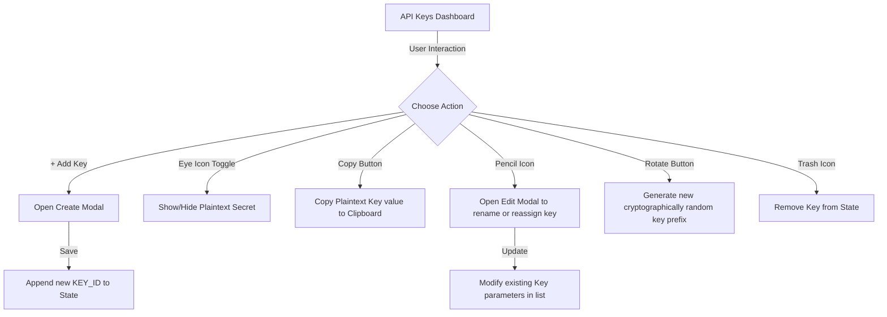

# Travel Booking Admin Panel - End-to-End Workflow Documentation

This document describes the end-to-end architecture, layouts, state management, and workflows of the Travel Booking App's Administration console, focusing in detail on the **Settings & Configuration System** (`Profile`, `Security & 2FA`, `Appearance`, `Connected APIs`, and `API Keys`).

---

## 1. System Architecture & Main Flow

The application is built as a single-page React app bundled with Vite. It employs a centralized context provider for state management and handles layout using a split admin shell containing a sidebar and header.



### Main Operations Flow
1. **User Authentication**: The admin accesses the panel via the `/login` route. Upon verification, the session is established.
2. **Admin Shell Shell**:
   - **Sidebar**: Provides navigation links to major segments (Dashboard, Analytics, Users, Staff, Todos, Flights, Hotels, Cabs, Packages, Itineraries, AI Chat, CMS, Support, Payments, Settings).
   - **Header**: Displays the active page header, toggle button for the sidebar (for mobile responsiveness), theme switch button, and basic admin stats.
   - **Page Loader**: Provides subtle transition animations between different routes.
3. **State Sync & Persistence**: Core preferences like the accent color, font choices, sidebar collapse state, and active admin profiles are saved dynamically via `localStorage` and managed globally through `AppContext.jsx`.

---

## 2. Centralized State Manager (`AppContext.jsx`)

The React Context (`AppContext`) acts as the state processor. It controls visual styles, profile modification, and notification dispatching.

| State / Utility | Purpose | Persistence Method |
| :--- | :--- | :--- |
| `theme` | Controls light and dark themes. | `localStorage.setItem("its_theme", value)` |
| `accentId` | Modifies standard colors to brand-specific accents (e.g. Ocean Blue, Royal Violet, Emerald). | `localStorage.setItem("its_accent", value)` |
| `fontId` | Sets the global font family (e.g. Inter, Outfit, Poppins). | `localStorage.setItem("its_font", value)` |
| `density` | Adjusts layout margins and paddings (Compact, Default, Relaxed). | `localStorage.setItem("its_density", value)` |
| `adminName` / `adminEmail` | Basic admin identity credentials. | `localStorage.setItem("its_admin_*", value)` |
| `toasts` | System messages array to display floating toast notifications. | Memory-only (Disappears on page reload) |

---

## 3. Settings Module Workflows

The settings dashboard (`src/pages/settings/Settings.jsx`) uses tabs to isolate administrative configurations:

```
[Profile] ── [Security & 2FA] ── [Appearance] ── [Connected APIs] ── [API Keys]
```

---

### A. Profile Tab & Personal Vault Workflow

This tab manages admin credentials and integrates a mock secure document vault for sensitive files.



#### Key Capabilities:
- **Profile Avatar Editing**: Converts selected images into Base64 URLs using the `FileReader` API, displaying a premium glassmorphic photo overlay. Restricts file size to `< 2MB`.
- **Personal Document Vault**:
  - Drag-and-drop file uploader area with an inline **Tag Selector** (`Legal`, `Technical`, `Identity`, `Finance`, `General`) to tag files upon upload.
  - Interactive file list displaying file name, dynamic conversion of bytes into readable megabytes (`MB`), upload timestamp, and colored tag badges.
  - **Search & Filtering**: A text search field to look up documents by name or tag, and quick filter pills to instantly segment documents by their category tags.
  - **Actions**:
    - **Download**: Mock triggers that dispatch notification alerts notifying the user of the secure file fetch.
    - **Delete**: Cleanses the selected document from state with warning notifications.

---

### B. Security & Two-Factor Authentication (2FA) Workflow

Protects the administrative account by facilitating password modifications and setting up secondary multi-factor locks.

#### Password Rotation Flow:
1. The admin enters their current password, a new password (`length >= 6`), and confirms the new password.
2. The tab triggers `changeAdminPassword(oldPass, newPass)` via `AppContext`.
3. If the current password matches the active session password, it updates the `its_admin_password` record in `localStorage` and alerts the user of the update.

#### 2FA Enablement Flow:


---

### C. Appearance Workflow (Theme & Customization)

Allows administrators to personalize the overall aesthetics of the panel, updating CSS attributes dynamically.



- **Theme Mode**: Swaps standard bright themes with customizable dark modes by changing the `data-theme` attribute at the root document element level.
- **Accent Palette**: Dynamically re-assigns variables like `--brand-500` (e.g. `#10b981` for Emerald) to quickly paint elements like primary buttons, active borders, and badges.
- **Typography Engine**: Switches global sans-serif and monospaced font declarations at runtime.
- **Density Control**: Swaps padding scales (`compact` for data-heavy viewports, `relaxed` for standard tablets/laptops) using CSS selector scoping (e.g., `html[data-density='compact']`).

---

### D. Connected APIs Gateway Workflow

Tracks the operational status and latency of connected microservices (e.g., flight routing systems, hotel endpoints, payment processors).

#### Service Verification Sequence:
1. Admin opens the tab and views a tabular list of connected APIs featuring badges: `active` (green), `warning` (orange), or `inactive` (gray).
2. **Search & Tag Filters**: Includes a search input to locate integrations by name, provider, type, or tags, along with filter pills (`All`, `GDS`, `Flights`, `Hotels`, `Global`, `Domestic`, `Maps`, `Navigation`) to segment them.
3. The user selects **"Test"** on a service.
4. The system dispatches a mock ping event and schedules a delay timer simulating round-trip latency (`Math.random() * 200 + 40`).
5. Upon resolution, it updates the corresponding table row with the exact latency response (e.g., `45ms`) and launches success notifications.
6. Admins can connect new APIs through modal dialogs (defining integration category, name, service provider, and custom comma-separated tags).

---

### E. API Credentials & Key Management Workflow

Manages secure authorization tokens generated for remote API communication.



#### Workflow Options:
- **Key Generation & Creation**: Allows registering new keys with validation checks and comma-separated tags metadata.
- **Search & Filtering**: Search bar and quick filters (`All`, `Payment`, `Maps`, `Auth`, `Flights`, `Production`, `Development`) to search and group keys by tag, description, or provider.
- **Toggle Visibility**: Obscures secrets with dots (`••••••••`) by default, allowing toggle checks to display values for verification.
- **Key Rotation**: Triggers key rotation, automatically generating a secure replacement credential with provider-specific prefixes (e.g., `sk_live_...` for Stripe, `rzp_live_...` for Razorpay) using a pseudorandom algorithm.
- **Revoking Keys**: Removes the credential profile from memory, instantly disconnecting any active access routes.

---

## 4. Troubleshooting and State Reset

Since the current configuration engine runs primarily client-side using mocks:
1. If the configuration states become corrupt or standard keys disappear, admins can clear the browser's `localStorage` or execute `localStorage.clear()` in the dev console.
2. Upon page reload, the global state manager will automatically seed the system with default values (`admin@itsglobal.in` profile, active theme preferences, default API keys, etc.).
